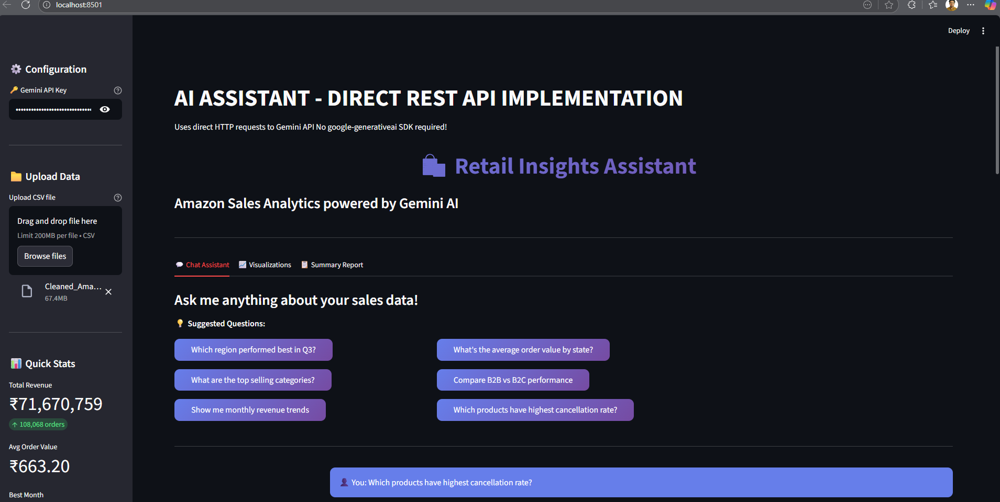
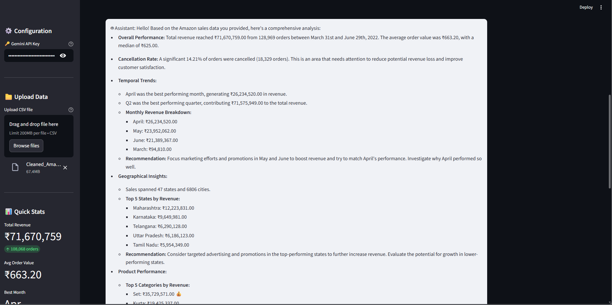
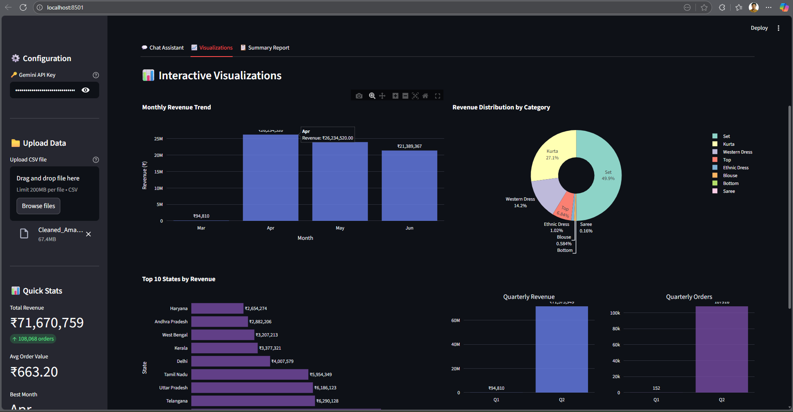
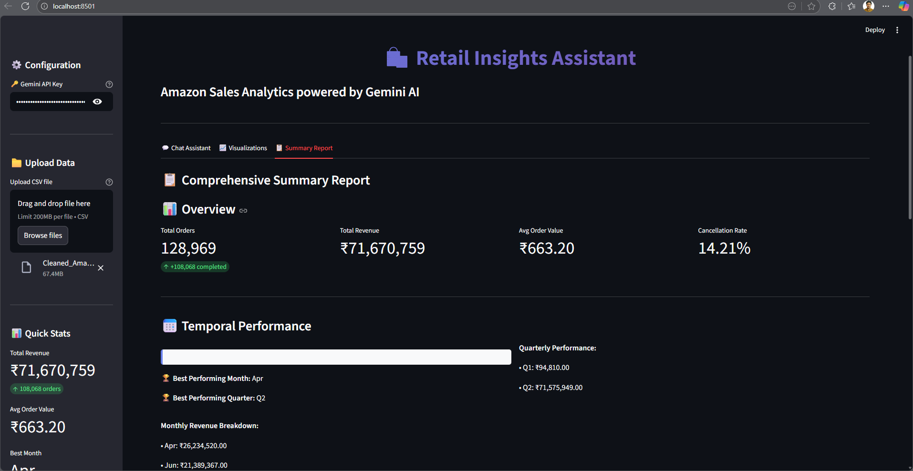
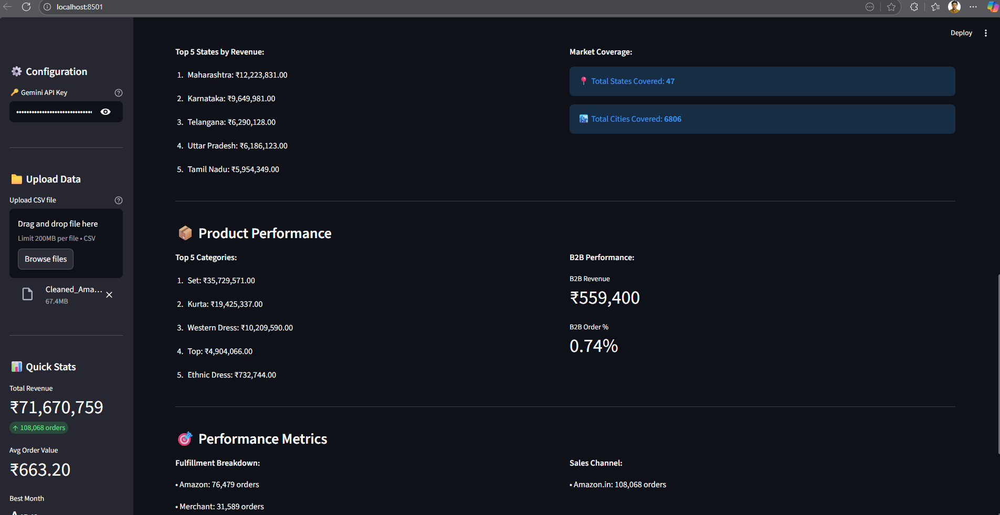

## 📌 Project Overview

**Retail Insights Assistant** is a production-ready **GenAI chatbot** that enables business users to ask **natural language questions** about Amazon sales data and receive **data-driven insights** instantly.

The system combines:

* **Python + Pandas** for analytics
* **Google Gemini Pro API** for natural language understanding
* **Streamlit** for an interactive UI
* A **scalable architecture design** capable of handling **100GB+ datasets**

---

## 🎯 Objectives

* Build a GenAI chatbot for **business analytics**
* Answer questions like:

  * *Which region performed best?*
  * *What are top-selling categories?*
  * *What is the cancellation rate?*
* Generate **summaries and reports**
* Propose a **scalable architecture** for large datasets

---

## 🧠 Key Features

✅ Natural-language business queries
✅ Automated sales summaries
✅ Revenue & performance analytics
✅ Interactive Streamlit UI
✅ Gemini AI integration
✅ Scalable design for big data (100GB+)

---

## 🗂️ Actual Project Structure

```
week4/
│
├── app.py
├── streamlit_app.py          # Main application
├── Cleaned_Amazon_Sale_Report.csv
├── sales_report.json         # Precomputed analytics summary
├── requirements.txt
├── README.md
├── Assignment.txt
├── Scalability Architecture for 100GB.md
│
├── 1.png   # Chat Interface
├── 2.png   # Example AI Answer
├── 3.png   # Sales Summary Output
├── 4.png   # Data Insights Visualization
├── 5.png   # Architecture / Scalability Diagram
```

---

## ⚙️ Tech Stack

| Layer               | Technology        |
| ------------------- | ----------------- |
| Language            | Python            |
| AI Model            | Google Gemini Pro |
| UI                  | Streamlit         |
| Analytics           | Pandas            |
| Visualization       | Streamlit charts  |
| Big Data (Design)   | Spark, BigQuery   |
| Deployment (Design) | Kubernetes        |

---

## 🚀 How to Run the Project

### 1️⃣ Activate Virtual Environment

```powershell
PS> & "C:\Users\SaisrisatyaPadala\Desktop\All Stars Training\week4\week4\Scripts\Activate.ps1"
```

---

### 2️⃣ Install Dependencies

```bash
pip install -r requirements.txt
```

---

### 3️⃣ Set Gemini API Key

Create a `.env` file or set environment variable:

```bash
GEMINI_API_KEY=AIzaSy*****
```

---

### 4️⃣ Run the Application

```bash
streamlit run streamlit_app.py
```

App opens at:
👉 **[http://localhost:8501](http://localhost:8501)**

---

## 📊 Dataset Used

**File:** `Cleaned_Amazon_Sale_Report.csv`

**Key Columns:**

* Order ID
* Date
* Status
* Category
* Amount
* Quantity
* City, State
* Fulfilled By
* Promotion IDs
* B2B Flag

The dataset is **cleaned, normalized, and analysis-ready**.

---

## 💬 Example Questions Supported

* Which state generated the highest revenue?
* What is the total revenue for April 2022?
* Which category sold the most?
* What is the cancellation rate?
* Compare B2B vs B2C sales
* Show monthly revenue trends

---

## 🖼️ Screenshots Explanation (IMPORTANT)

### 📸 Screenshot 1 — `1.png`


**Chat Interface**

Shows the main Streamlit UI where:

* User enters business questions
* AI chatbot interaction happens
* Clean and intuitive design

---

### 📸 Screenshot 2 — `2.png`

**AI-Generated Answer**

Demonstrates:

* Gemini AI answering a business question
* Clear, structured, business-friendly response
* Metrics-based explanation

---

### 📸 Screenshot 3 — `3.png`

**Sales Summary Output**

Displays:

* Total revenue
* Total orders
* Cancelled orders
* Top states and categories

This summary is generated programmatically and fed to the AI.

---

### 📸 Screenshot 4 — `4.png`

**Data Insights & Analytics**

Shows:

* Aggregated insights
* Tabular or chart-based analysis
* Useful for decision-makers

---

### 📸 Screenshot 5 — `5.png`

**Scalability Architecture (100GB Data)**

Illustrates:

* Cloud-based data ingestion
* Spark processing
* BigQuery storage
* AI query pipeline
* Caching & retrieval layers

---

## 🏗️ Scalability: Handling 100GB+ Data

### ❌ Problem with CSV + Pandas

* Memory limits
* Slow queries
* Not production-ready

---

### ✅ Proposed Scalable Architecture

**Data Ingestion**

* Cloud Storage (GCS / S3)
* Batch ingestion

**Processing**

* Apache Spark / Databricks
* Daily & monthly aggregations

**Storage**

* BigQuery / Snowflake
* Partitioned tables

**AI Query Flow**

```
User Question
   ↓
Intent Detection
   ↓
SQL / Aggregation Query
   ↓
Summary Data
   ↓
Gemini AI
   ↓
Final Answer
```

**Caching**

* Redis for frequent queries

**Deployment**

* Docker + Kubernetes
* Horizontal Pod Autoscaling

---

## 🧪 Why This Project Is Production-Ready

✔ Clean architecture
✔ Clear separation of AI & analytics
✔ Prompt-engineering included
✔ Scales from CSV → Big Data
✔ Real business use case
✔ Fully explainable

---

## 📦 Deliverables Checklist

✅ Working GenAI chatbot
✅ Cleaned dataset
✅ Screenshots (1–5)
✅ Scalability architecture document
✅ Complete README
✅ Ready for evaluation

---

## 🏁 Conclusion

The **Retail Insights Assistant** demonstrates how **Generative AI + Analytics** can transform raw sales data into **actionable business intelligence**, while being **scalable, maintainable, and production-ready**.

